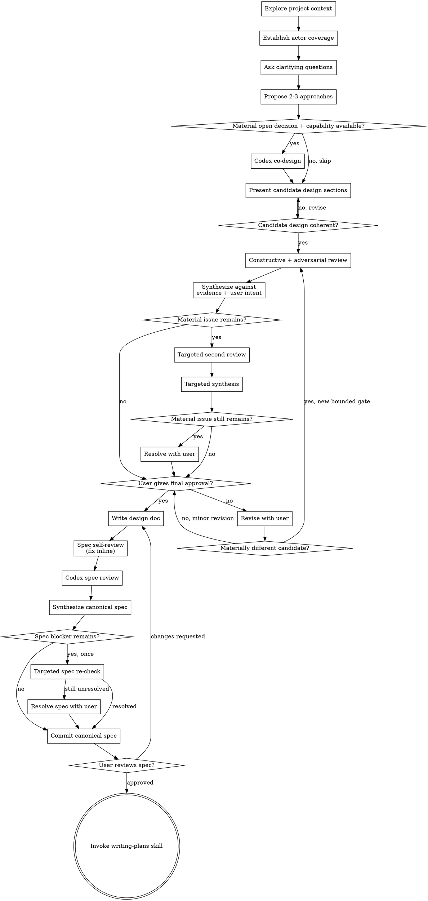

# Brainstorming Ideas Into Designs

Help turn ideas into fully formed designs and specs through natural collaborative dialogue.

Start by understanding the current project context, then ask questions one at a time to refine the idea. Once you understand what you're building, present the design and get user approval.

<HARD-GATE>
Do NOT invoke any implementation skill, write any code, scaffold any project, or take any implementation action until you have presented a design and the user has approved it. This applies to EVERY project regardless of perceived simplicity.
</HARD-GATE>

## Anti-Pattern: "This Is Too Simple To Need A Design"

Every project goes through this process. A todo list, a single-function utility, a config change — all of them. "Simple" projects are where unexamined assumptions cause the most wasted work. The design can be short (a few sentences for truly simple projects), but you MUST present it and get approval.

## Checklist

You MUST create a task for each of these items and complete them in order:

1. **Explore project context** — check files, docs, recent commits
2. **Establish actor coverage — "who uses this, from where, doing what?"** — before any design question, account for every material actor, surface/runtime, capability constraint, and success condition. Trivial single-actor work takes one compact actor statement; complex work takes the full table. See "Actor Coverage" below.
3. **Offer the visual companion just-in-time** — NOT upfront. The first time a question would genuinely be clearer shown than described, offer it then (its own message); on approval its browser tab opens for you. If no visual question ever arises, never offer it. See the Visual Companion section below.
4. **Ask clarifying questions** — one at a time, understand purpose/constraints/success criteria
5. **Propose 2-3 approaches** — with trade-offs and your recommendation
6. **Codex co-design (value-triggered)** — when a second model is available AND a material open design decision would benefit from an independent perspective, dispatch Codex as a DESIGN PARTNER (not a reviewer) after the approaches exist. Skip it for routine work. See "Codex Co-design" below.
7. **Present candidate design** — in sections scaled to their complexity, validate each section with the user
8. **Review and synthesize design** — after the full candidate is coherent, run constructive and adversarial review, synthesize against evidence and user intent, then get final user approval (see below)
9. **Write design doc** — save to `docs/superpowers/specs/YYYY-MM-DD-<topic>-design.md`
10. **Spec self-review** — quick inline check for placeholders, contradictions, ambiguity, scope (see below)
11. **Review and synthesize written spec** — run Codex adversarial/completeness review, verify and apply findings, and establish the canonical spec
12. **User reviews written spec** — ask user to review the canonical spec before proceeding
13. **Transition to implementation** — invoke writing-plans skill to create implementation plan

## Process Flow



**The terminal state is invoking writing-plans.** Do NOT invoke frontend-design, mcp-builder, or any other implementation skill. The ONLY skill you invoke after brainstorming is writing-plans.

## The Process

**Understanding the idea:**

- Check out the current project state first (files, docs, recent commits)
- Before asking detailed questions, assess scope: if the request describes multiple independent subsystems (e.g., "build a platform with chat, file storage, billing, and analytics"), flag this immediately. Don't spend questions refining details of a project that needs to be decomposed first.
- If the project is too large for a single spec, help the user decompose into sub-projects: what are the independent pieces, how do they relate, what order should they be built? Then brainstorm the first sub-project through the normal design flow. Each sub-project gets its own spec → plan → implementation cycle.
- Once scope is settled, establish actor coverage (see "Actor Coverage" below) — a compact statement or the full table — and resolve material uncertainty with the user before other detailed questions
- For appropriately-scoped projects, ask questions one at a time to refine the idea
- Prefer multiple choice questions when possible, but open-ended is fine too
- Only one question per message - if a topic needs more exploration, break it into multiple questions
- Focus on understanding: purpose, constraints, success criteria

**Exploring approaches:**

- Propose 2-3 different approaches with trade-offs
- Present options conversationally with your recommendation and reasoning
- Lead with your recommended option and explain why
- YAGNI ruthlessly - remove unnecessary features from every approach and design

**Presenting the design:**

- Once you believe you understand what you're building, present the design
- Scale each section to its complexity: a few sentences if straightforward, up to 200-300 words if nuanced
- Ask after each section whether it looks right so far; these checks make the complete design a coherent review candidate, not yet the final approval
- Cover: architecture, components, data flow, error handling, testing
- Be ready to go back and clarify if something doesn't make sense

**Design for isolation and clarity:**

- Break the system into smaller units that each have one clear purpose, communicate through well-defined interfaces, and can be understood and tested independently
- For each unit, you should be able to answer: what does it do, how do you use it, and what does it depend on?
- Can someone understand what a unit does without reading its internals? Can you change the internals without breaking consumers? If not, the boundaries need work.
- Smaller, well-bounded units are also easier for you to work with - you reason better about code you can hold in context at once, and your edits are more reliable when files are focused. When a file grows large, that's often a signal that it's doing too much.

**Working in existing codebases:**

- Explore the current structure before proposing changes. Follow existing patterns.
- Where existing code has problems that affect the work (e.g., a file that's grown too large, unclear boundaries, tangled responsibilities), include targeted improvements as part of the design - the way a good developer improves code they're working in.
- Don't propose unrelated refactoring. Stay focused on what serves the current goal.

## Actor Coverage (mandatory analysis; the table when complexity justifies it)

A design or plan that has not accounted for every material actor, surface, capability constraint,
and success condition is mis-scoped. The ANALYSIS is mandatory for every design; the tabular
format is not.

**Compact actor statement** — for genuinely single-actor, single-surface, low-risk work, one
sentence-pair suffices:

```markdown
**Actor scope:** Developer using the CLI to correct one configuration value. Success means the
existing validation command passes with the intended value.
```

**Full actors table** — required when ANY of these applies: multiple human users · multiple
surfaces or runtimes · humans plus agents/automations · meaningful handoffs between systems ·
materially different capabilities · different success conditions · cross-platform workflows ·
agent-facing APIs, tools, or protocols · uncertainty about who actually consumes the result.

```markdown
| Actor | Surface/runtime | Job to be done | Capability constraints | Success test |
|---|---|---|---|---|
```

- **Actor:** human, agent, automation, external system, or operational role.
- **Surface/runtime:** browser, mobile app, shell, server process, scheduled job, API client, or other execution environment.
- **Job to be done:** what the actor is actually trying to accomplish.
- **Capability constraints:** limits that materially affect the design — e.g. cannot run shell commands, move files, retain state, access credentials, or receive interactive input.
- **Success test:** the observable condition under which THIS actor calls the outcome successful.

Rules (they apply to the compact statement AND the table — the format changes, the discipline doesn't):
- Draft actor coverage from inspected evidence and the user's statements — never invent actors. Mark ANY uncertain actor, surface, capability constraint, or success condition `UNCONFIRMED` and resolve material uncertainty before proposing approaches. Uncertainty about who consumes the result always triggers the full table.
- A row per REAL combination — "the user" is never one row if they act from two surfaces with different capabilities (browser vs shell, phone vs desktop).
- Capabilities constrain design: an actor that cannot move bytes, run a shell, or hold state needs a different pipeline, not a footnote. If two rows need two mechanisms, the design says so explicitly — one mechanism that serves only some rows is a mis-scoped design.
- Reviews cannot catch what the scope never contained. This is the frame-check; intelligence spent after a wrong frame only polishes the wrong thing (proven: a heavily-reviewed design once served one platform while the real task crossed two — e.g. browser Claude cannot move files; shell agents can).

## Codex Co-design (design partner, not reviewer)

Dispatch a second strong model (the official `codex:codex-rescue` subagent or equivalent) as a
co-designer only when BOTH hold:

1. the capability is available, AND
2. a material open design decision would benefit from an independent constructive perspective —
   e.g. multiple actors or surfaces; consequential architecture choices; APIs, protocols, agent
   interfaces, or tool ergonomics; decisions expensive to reverse; significant uncertainty between
   approaches; Codex is itself a user or implementer of the result; the user asked for multi-model
   design; or you have low confidence in your preferred approach.

SKIP it — even when available — when the task is routine or mechanical, the approaches differ only
trivially, no material design decision remains open, or the later adversarial review is
sufficient. Never invoke it merely for symmetry.

When triggered, dispatch AFTER the 2-3 approaches exist and BEFORE presenting candidate design
sections — a collaborator working the open design questions, not a critic of finished output:

- Give it: the actor coverage, intent + constraints + success criteria, repository evidence, and the OPEN design questions.
- Ask for: concrete positions with reasoning, explicit disagreements with your working assumptions, and artifacts it would want as a user (exact config text, templates, naming).
- Synthesize: adopt evidence-backed positions; where you reject one, record why. MATERIAL disagreement is design evidence — it exposes different assumptions, conflicting evidence, different actor needs, a consequential trade-off, feasibility uncertainty, or different failure modes. Ignore wording differences, preference-only redesign, stylistic disagreement, equivalent solutions with no material consequence, and speculative concerns outside the approved scope. You own the synthesis; do not vote between models.

Reviewer independence: the same model may co-design here and adversarially review later, but the
later review must run in a FRESH thread/context. Give that reviewer the approved intent, confirmed
actor coverage, constraints, repository evidence, and the coherent candidate design — NOT the
earlier co-design response, your defence of the chosen design, or commentary steering what it
should or should not flag. This is not perfect independence, but it reduces anchoring and prevents
the review from merely reaffirming its earlier position.

If no co-design capability exists, state that the perspective was unavailable and continue — never
block the workflow. If a dispatch was attempted and failed (start, auth, completion, or unusable
output), report the failure and ask whether to retry or continue without it — same rules as the
Design Review Gate; never silently substitute your own answer for a failed invocation.

## Design Review Gate

Run this gate once the project context is inspected, intent and constraints are understood, approaches have been explored, and the complete candidate design is coherent. Do not run it on every message or unfinished design section.

Use [design-reviewer-prompt.md](design-reviewer-prompt.md) to dispatch:

1. a Claude constructive reviewer; and
2. a Codex adversarial reviewer through the official Codex integration when available.

Both reviews are read-only and capability-dependent. If a reviewer capability is absent before dispatch, apply that reviewer's rubric yourself, tell the user which independent perspective was unavailable, and continue — never invent a command or block the generic workflow. If an available reviewer fails to start, authenticate, finish, or return usable output, report the actionable failure and ask whether to retry or proceed with an explicitly degraded self-review. Do not silently substitute your own answer for a failed invocation.

**Synthesis:**

- Compare both reviews with the user's stated intent and constraints.
- Verify load-bearing factual disputes against repository evidence or authoritative documentation where practical. Mark material claims `VERIFIED`, `INFERRED`, or `UNSUPPORTED` when that distinction helps the decision.
- Ask: **Can this be materially simpler while still fully solving the current requirement?** Remove premature abstractions, speculative extensibility, and unnecessary interfaces, adapters, factories, service layers, dependencies, or configuration. Simple must remain correct and maintainable.
- Accept evidence-backed findings; reject preference-only redesign and invented requirements. Codex is an input, not final authority. Do not vote.
- Present the synthesized design and explain material accepted or rejected findings before asking for final user approval.

Run at most one targeted second review using the scoped contract in [design-reviewer-prompt.md](design-reviewer-prompt.md), and only when a blocker remains, an important factual dispute is unresolved, or synthesis materially changed the design and needs re-checking. Dispatch only the reviewer needed for that issue. Optional findings never trigger another pass. If a material issue remains after the targeted pass, surface it to the user instead of starting a debate loop.

User-requested revisions after synthesis restart the bounded gate only when they produce a materially different coherent candidate. Minor corrections return directly to final approval. Withholding approval by itself does not restart reviewers.

## After the Design

**Documentation:**

- Write the validated design (spec) to `docs/superpowers/specs/YYYY-MM-DD-<topic>-design.md`
  - (User preferences for spec location override this default)
- Use elements-of-style:writing-clearly-and-concisely skill if available

**Spec Self-Review:**
After writing the spec document, look at it with fresh eyes:

1. **Placeholder scan:** Any "TBD", "TODO", incomplete sections, or vague requirements? Fix them.
2. **Internal consistency:** Do any sections contradict each other? Does the architecture match the feature descriptions?
3. **Scope check:** Is this focused enough for a single implementation plan, or does it need decomposition?
4. **Ambiguity check:** Could any requirement be interpreted two different ways? If so, pick one and make it explicit.

Fix any issues inline. No need to re-review — just fix and move on.

**Written Spec Review Gate:**

After self-review, dispatch a fresh, read-only Codex review using [spec-document-reviewer-prompt.md](spec-document-reviewer-prompt.md). The central question is: **Could another competent coding agent implement this specification without making material assumptions?**

The independent review must challenge blockers, ambiguity, unsupported or hallucinated claims, missing acceptance criteria and tests, invented requirements, unnecessary complexity, missing edge cases, and unimplementable dependencies. It must ask whether the requirement can be solved materially more simply without becoming brittle or incomplete.

Use the official `codex:codex-rescue` subagent for the in-conversation spec review when available. Apply the same capability-absence and invocation-failure handling as the Design Review Gate: disclose degraded self-review when capability is absent; for setup, authentication, dispatch, completion, or result failure, report the failure and ask whether to retry or explicitly continue degraded. Never fabricate reviewer output.

Synthesize findings into the spec before asking the user to review it:

- Before canonicalizing the spec, identify and verify its load-bearing technical claims and repository assumptions, including every one flagged by review, against repository evidence, observed output, or authoritative documentation. If verification is not practical, label the claim `UNSUPPORTED` and resolve it with the user; never present it as fact or silently proceed.
- Resolve blockers, ambiguities, missing acceptance criteria, missing tests, and implementability gaps.
- Reject invented requirements and preference-only redesign that conflict with approved intent.
- Ask: **Can this be materially simpler while still fully solving the current requirement?**
- The primary agent owns the canonical spec. Codex reports findings; it does not rewrite the spec or make the final decision.

Use at most one targeted re-check, only for an unresolved blocker or material factual dispute after synthesis. Optional or advisory findings do not trigger another pass. If a material issue remains, resolve it with the user instead of starting another reviewer loop.

Commit the canonical spec after synthesis and any targeted re-check or user resolution. Verify the committed file contains the reviewed version before asking for approval.

**User Review Gate:**
After the written spec review gate passes, ask the user to review the canonical spec before proceeding:

> "Spec written and committed to `<path>`. Please review it and let me know if you want to make any changes before we start writing out the implementation plan."

Wait for the user's response. If they request changes, make them and re-run self-review plus the written spec review gate. Only proceed once the user approves.

**Implementation:**

- Invoke the writing-plans skill to create a detailed implementation plan
- Do NOT invoke any other skill. writing-plans is the next step.

## Visual Companion

A browser-based companion for showing mockups, diagrams, and visual options during brainstorming. Available as a tool — not a mode. Accepting the companion means it's available for questions that benefit from visual treatment; it does NOT mean every question goes through the browser.

**Offering the companion (just-in-time):** Do NOT offer it upfront. Wait until a question would genuinely be clearer shown than told — a real mockup / layout / diagram question, not merely a UI *topic*. The first time that happens, offer it then, as its own message:
> "This next part might be easier if I show you — I can put together mockups, diagrams, and comparisons in a browser tab as we go. It's still new and can be token-intensive. Want me to? I'll open it for you."

**This offer MUST be its own message.** Only the offer — no clarifying question, summary, or other content. Wait for the user's response. If they accept, start the server with `--open` so their browser opens to the first screen automatically. If they decline, continue text-only and don't offer again unless they raise it.

**Per-question decision:** Even after the user accepts, decide FOR EACH QUESTION whether to use the browser or the terminal. The test: **would the user understand this better by seeing it than reading it?**

- **Use the browser** for content that IS visual — mockups, wireframes, layout comparisons, architecture diagrams, side-by-side visual designs
- **Use the terminal** for content that is text — requirements questions, conceptual choices, tradeoff lists, A/B/C/D text options, scope decisions

A question about a UI topic is not automatically a visual question. "What does personality mean in this context?" is a conceptual question — use the terminal. "Which wizard layout works better?" is a visual question — use the browser.

If they agree to the companion, read the detailed guide before proceeding:
`skills/brainstorming/visual-companion.md`
