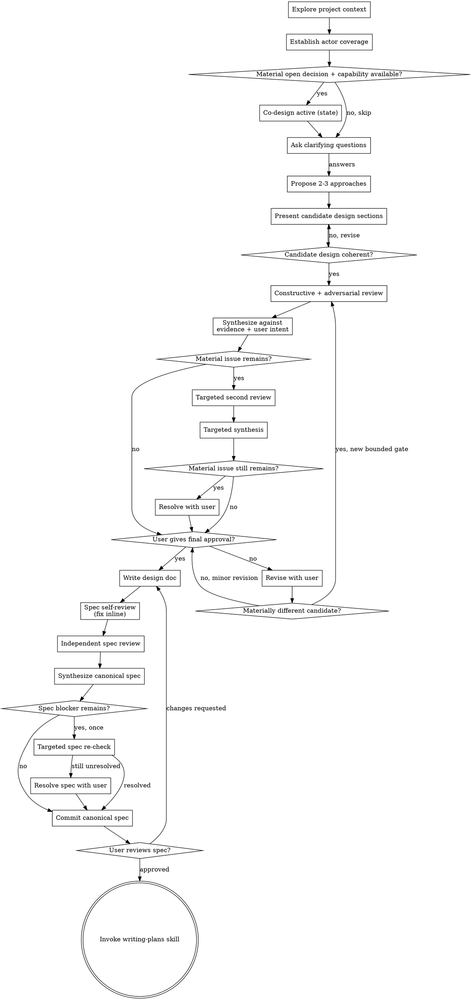

# Brainstorming Ideas Into Designs

Help turn ideas into fully formed designs and specs through natural collaborative dialogue.

Start by understanding the current project context, then ask focused questions — a single question, a small thematic batch, or a concise list — to refine the idea. Once you understand what you're building, present the design and get user approval.

<HARD-GATE>
Do NOT invoke any implementation skill, write any code, scaffold any project, or take any implementation action until you have presented a design and the user has approved it. This applies to EVERY project regardless of perceived simplicity.
</HARD-GATE>

## Anti-Pattern: "This Is Too Simple To Need A Design"

Every project goes through this process. A todo list, a single-function utility, a config change — all of them. "Simple" projects are where unexamined assumptions cause the most wasted work. The design can be short (a few sentences for truly simple projects), but you MUST present it and get approval.

## Checklist

You MUST create a task for each of these items and complete them in order:

1. **Explore project context** — check files, docs, recent commits
2. **Establish actor coverage — "who uses this, from where, doing what?"** — before any design question, account for every material actor, surface/runtime, capability constraint, and success condition. Trivial single-actor work takes one compact actor statement; complex work takes the full table. See "Actor Coverage" below.
3. **Decide independent co-design (value-triggered)** — right after actor coverage, judge whether BOTH hold: an independent model route is available AND a material open design decision would benefit from a second perspective. If yes, the discovery and approach steps below are generated blind (SA and the independent co-designer each work first, then the SA merges/synthesizes). If no, skip and run them normally. Revisit if discovery later exposes a material decision. See "Independent Co-design" below.
4. **Offer the visual companion just-in-time** — NOT upfront. The first time a question would genuinely be clearer shown than described, offer it then (its own message); on approval its browser tab opens for you. If no visual question ever arises, never offer it. See the Visual Companion section below.
5. **Ask clarifying questions** — as a single question, a small thematic batch, or a concise list; understand purpose/constraints/success criteria. When co-design is active, the SA and the independent co-designer draft questions blind, then the SA merges, dedupes, and presents.
6. **Propose 2-3 approaches** — with trade-offs and your recommendation. When co-design is active, the SA and the independent co-designer develop approaches blind, then the SA synthesizes the simplest complete candidate.
7. **Present candidate design** — in sections scaled to their complexity, validate each section with the user
8. **Review and synthesize design** — after the full candidate is coherent, run constructive and adversarial review, synthesize against evidence and user intent, then get final user approval (see below) (Foreman-present: if your brief names a seat, the review is commissioned by the foreman — submit your artifacts to it and do not choose the reviewer or write the review brief; gate mechanics otherwise identical.)
9. **Write design doc** — save to `docs/superpowers/specs/YYYY-MM-DD-<topic>-design.md`
10. **Spec self-review** — quick inline check for placeholders, contradictions, ambiguity, scope (see below)
11. **Review and synthesize written spec** — run an independent adversarial/completeness review, verify and apply findings, and establish the canonical spec (Foreman-present: if your brief names a seat, the review is commissioned by the foreman — submit your artifacts to it and do not choose the reviewer or write the review brief; gate mechanics otherwise identical.)
12. **User reviews written spec** — ask user to review the canonical spec before proceeding
13. **Transition to implementation** — invoke writing-plans skill to create implementation plan

## Process Flow



**"Co-design active" is a state, not a step.** It does not do work before discovery. When it holds: the *Ask clarifying questions* step runs blind SA + independent question generation, then merge/filter/present, BEFORE the user answers; then, after the user's answers, the *Propose 2-3 approaches* step runs blind SA + independent approach generation, then synthesis. Order is always discovery questions → user answers → approach generation, co-design on or off (see "Independent Co-design").

**The terminal state is invoking writing-plans.** Do NOT invoke frontend-design, mcp-builder, or any other implementation skill. The ONLY skill you invoke after brainstorming is writing-plans.

## The Process

**Understanding the idea:**

- Check out the current project state first (files, docs, recent commits)
- Before asking detailed questions, assess scope: if the request describes multiple independent subsystems (e.g., "build a platform with chat, file storage, billing, and analytics"), flag this immediately. Don't spend questions refining details of a project that needs to be decomposed first.
- If the project is too large for a single spec, help the user decompose into sub-projects: what are the independent pieces, how do they relate, what order should they be built? Then brainstorm the first sub-project through the normal design flow. Each sub-project gets its own spec → plan → implementation cycle.
- Once scope is settled, establish actor coverage (see "Actor Coverage" below) — a compact statement or the full table — and resolve material uncertainty with the user before other detailed questions
- For appropriately-scoped projects, ask focused questions to refine the idea — choose the format that makes discovery efficient: a single question, a small thematic batch of related questions, or a concise numbered list
- Batch when the questions are related and independently answerable and batching avoids conversational delay; use a single follow-up when one answer determines what to ask next, or when a point is ambiguous or sensitive
- Keep questions open and concrete — never embed your preferred solution, and never restrict the user to agent-generated options. Multiple-choice may make a question easier to grasp, but it must not stop the user from giving another answer. Leave room for answers neither model anticipated
- Focus on understanding: purpose, constraints, success criteria

**Exploring approaches:**

- Propose 2-3 different approaches with trade-offs
- Present options conversationally with your recommendation and reasoning
- Lead with your recommended option and explain why
- YAGNI ruthlessly - remove unnecessary features from every approach and design

**Presenting the design:**

- Once you believe you understand what you're building, present the design
- Scale each section to its complexity: a few sentences if straightforward, up to 200-300 words if nuanced
- Ask after each section whether it looks right so far; these checks make the complete design a coherent review candidate, not yet the final approval
- Cover: architecture, components, data flow, error handling, testing
- Be ready to go back and clarify if something doesn't make sense

**Design for isolation and clarity:**

- Break the system into smaller units that each have one clear purpose, communicate through well-defined interfaces, and can be understood and tested independently
- For each unit, you should be able to answer: what does it do, how do you use it, and what does it depend on?
- Can someone understand what a unit does without reading its internals? Can you change the internals without breaking consumers? If not, the boundaries need work.
- Smaller, well-bounded units are also easier for you to work with - you reason better about code you can hold in context at once, and your edits are more reliable when files are focused. When a file grows large, that's often a signal that it's doing too much.

**Working in existing codebases:**

- Explore the current structure before proposing changes. Follow existing patterns.
- Where existing code has problems that affect the work (e.g., a file that's grown too large, unclear boundaries, tangled responsibilities), include targeted improvements as part of the design - the way a good developer improves code they're working in.
- Don't propose unrelated refactoring. Stay focused on what serves the current goal.

## Actor Coverage (mandatory analysis; the table when complexity justifies it)

A design or plan that has not accounted for every material actor, surface, capability constraint,
and success condition is mis-scoped. The ANALYSIS is mandatory for every design; the tabular
format is not.

**Compact actor statement** — for genuinely single-actor, single-surface, low-risk work, one
sentence-pair suffices:

```markdown
**Actor scope:** Developer using the CLI to correct one configuration value. Success means the
existing validation command passes with the intended value.
```

**Full actors table** — required when ANY of these applies: multiple human users · multiple
surfaces or runtimes · humans plus agents/automations · meaningful handoffs between systems ·
materially different capabilities · different success conditions · cross-platform workflows ·
agent-facing APIs, tools, or protocols · uncertainty about who actually consumes the result.

```markdown
| Actor | Surface/runtime | Job to be done | Capability constraints | Success test |
|---|---|---|---|---|
```

- **Actor:** human, agent, automation, external system, or operational role.
- **Surface/runtime:** browser, mobile app, shell, server process, scheduled job, API client, or other execution environment.
- **Job to be done:** what the actor is actually trying to accomplish.
- **Capability constraints:** limits that materially affect the design — e.g. cannot run shell commands, move files, retain state, access credentials, or receive interactive input.
- **Success test:** the observable condition under which THIS actor calls the outcome successful.

Rules (they apply to the compact statement AND the table — the format changes, the discipline doesn't):
- Draft actor coverage from inspected evidence and the user's statements (repository files, project docs, observed workflows, confirmed external constraints) — never invent actors or requirements. Mark ANY uncertain actor, surface, capability constraint, or success condition `UNCONFIRMED` and resolve material uncertainty before proposing approaches; minor uncertainty may remain visibly marked where it does not prevent a valid design. Uncertainty about who consumes the result always triggers the full table.
- A row per REAL combination — "the user" is never one row if they act from two surfaces with different capabilities (browser vs shell, phone vs desktop).
- Capabilities constrain design: an actor that cannot move bytes, run a shell, or hold state needs a different pipeline, not a footnote. If two rows need two mechanisms, the design says so explicitly — one mechanism that serves only some rows is a mis-scoped design.
- Reviews cannot catch what the scope never contained. This is the frame-check; intelligence spent after a wrong frame only polishes the wrong thing (proven: a heavily-reviewed design once served one platform while the real task crossed two — e.g. browser Claude cannot move files; shell agents can).

## Independent Co-design (design partner, not reviewer)

**Roles are defined independently of model brand.** The same rules hold whichever model fills a role:

- **Primary System Agent (SA):** owns user dialogue, orchestration, evidence gathering, synthesis, adjudication, the canonical design and spec, and every final decision.
- **Independent co-designer:** works from a fresh context and a neutral brief; proposes discovery questions, develops independent approaches, names assumptions and trade-offs. It does NOT make the final decision.
- **Reviewer / implementer / verifier** are defined in the review gates below and in subagent-driven-development.

Verification comes from repository evidence, version-control history, tests, type/compiler checks, runtime behaviour, authoritative documentation, and observed tool output — a model statement is not verification by itself.

**Capability bindings (Claude Code today).** The SA is the parent session. An independent role may be filled by a fresh separate context of the same family, or by the `codex:codex-rescue` subagent. Where practical, use a DIFFERENT model family for the independent role; when only one family is available, use a fresh isolated context and disclose that model-family independence was unavailable. In another harness, bind these same roles to the routes that actually exist there — never invent a route (e.g. a reverse dispatch) that is not installed and verified merely to make the prose symmetrical.

**When to run co-design — BOTH must hold:**

1. an independent capability is available, AND
2. a material open design decision would benefit from a second constructive perspective — multiple actors or surfaces; materially different actor capabilities; consequential or hard-to-reverse architecture; APIs, protocols, agent interfaces, or tool ergonomics; several credible approaches with real trade-offs; significant uncertainty; the independent model is itself a user or implementer of the result; the user asked for multi-model design; or low SA confidence in the preferred approach.

SKIP it — even when a second model is available — for routine or mechanical work, trivially different approaches, no open material decision, or when the later review gate is sufficient challenge. Never invoke for symmetry. When skipped, the SA still performs proportionate actor, requirement, and success-condition discovery, and the review gates remain available where justified.

**When it runs, it spans discovery and approaches — BOTH generated blind:**

1. **Independent question generation (during discovery).** The SA drafts the questions it believes must be answered. The independent co-designer receives the same neutral brief and drafts its own. Neither sees the other's list before producing its own. Then the SA does NOT present every question — raw model output can be long (an independent probe once produced 14). The SA: merges the two sets; deduplicates; drops questions already answered by inspected evidence; drops low-value curiosity; drops questions whose answers would not materially change the design; orders what remains naturally; and presents the smallest useful set. **Keep a question only if its answer could materially change actor coverage, scope, constraints, success conditions, architecture, implementation feasibility, security, or failure handling.** There is no numeric maximum — the rule is: ask the smallest set of questions needed to prevent material assumptions. Lists and small batches remain allowed. The SA never answers an unresolved question itself and never converts missing information into an invented requirement. Material answers may prompt targeted follow-ups from either side.
2. **Independent approach generation (after discovery).** The SA develops its approaches and provisional recommendation; the independent co-designer develops approaches from the same neutral brief; neither sees the other's conclusions first. The SA then compares and synthesizes into the simplest complete candidate, before presenting candidate design sections.

**Neutral brief — prevents SA anchoring.** The independent role receives: the user's verbatim statements or faithful summaries, confirmed actor coverage, confirmed constraints and success conditions, relevant repository files and observed facts, the unresolved facts and user-originated open questions (never either side's drafted discovery-question list — that stays private until both lists are complete), and authoritative external evidence where applicable. It must NOT receive: the SA's preferred solution or recommendation, a defence of any approach, another model's conclusions, or case-specific steering about what to flag or not flag. The fixed role rubric — the standing list of what a reviewer's or co-designer's role checks for — is not steering and is always allowed; the ban is on advocacy and per-finding steering, not on telling a role what its job is. This anti-anchoring rule applies to co-design AND to later review.

**Synthesis — material disagreement only.** Adopt evidence-backed positions; where you reject one, record why. MATERIAL disagreement is design evidence — different assumptions, conflicting evidence, different actor needs, a consequential trade-off, feasibility uncertainty, or different failure/security modes. Ignore wording, style, preference-only redesign, equivalent solutions with no material consequence, and speculative concerns outside confirmed scope. Explain material accepted and rejected positions where it helps the user understand the design. You own the synthesis; do not vote between models, and do not build an exhaustive disagreement ledger.

**Reviewer independence.** The same model may co-design here and adversarially review later, but the later review runs in a FRESH context with the neutral review brief (approved intent, confirmed actor coverage, constraints, repository evidence, and the coherent candidate) — NOT the earlier co-design response, your defence of the chosen design, or commentary steering what it should or should not flag. This is not perfect independence, but it reduces anchoring and prevents the review from merely reaffirming its earlier position.

**Degradation.** If no independent capability exists, state that the independent perspective was unavailable and continue — use a fresh isolated self-review where useful; never fabricate a second-model result, never block. If a dispatch was attempted and failed (setup, auth, dispatch, completion, or unusable output), report the actionable failure and ask whether to retry or explicitly continue with reduced independence — same rules as the Design Review Gate; never silently substitute your own answer for a failed invocation.

## Simplicity and Defect Handling (governing rules)

These govern design, synthesis, and every review gate below — they are not optional reviewer advice.

**Simplicity is the default.** Select the simplest complete solution. Every added component, abstraction, dependency, configuration option, workflow stage, or requirement carries the burden of proof — justified only by confirmed actor needs, confirmed constraints, observable success conditions, or necessary correctness, security, or maintainability. Do not add architecture for hypothetical scale, possible future consumers, unrequested extensibility, abstract purity, model preference, or convention with no current need. When two solutions both fully satisfy the requirement, choose the simpler. Simple never means incomplete, fragile, insecure, or untestable — it means no unjustified machinery. Visible process scales with complexity too: a trivial task gets a compact actor statement, brief discovery (a single question or short list as warranted — sometimes none beyond a confirmation), and a concise design; a cross-platform or agentic system may need the full process.

**Subtractive before additive.** For each material finding, evaluate remedies in order — **Delete → Narrow → Simplify → Reuse → Clarify → Add only what remains necessary.** Before recommending anything additive, ask: can the problematic scope be removed; is the defect caused by unnecessary scope or an invented/unconfirmed requirement; can an existing mechanism solve it; can the failure state be made impossible; would the fix cost more complexity than the defect warrants? A missing capability is a defect only when a confirmed actor, approved requirement, stated constraint, observable success test, or necessary correctness/security demands it. Reject additive recommendations that have no confirmed need.

Every BLOCKER or IMPORTANT finding reports the confirmed requirement affected and the smallest valid correction. A finding whose correction ADDS something reports two more lines — the subtractive option considered, and why adding is still necessary:

```text
Finding:
Confirmed requirement affected:
Smallest valid correction:
(additive corrections only) Subtractive option considered:
(additive corrections only) Why an additive change is still necessary:
```

Do not force this onto OPTIONAL or minor findings, where it costs more than it returns.

## Design Review Gate

Run this gate once the project context is inspected, intent and constraints are understood, approaches have been explored, and the complete candidate design is coherent. Do not run it on every message or unfinished design section.

Use [design-reviewer-prompt.md](design-reviewer-prompt.md) to dispatch two independent read-only reviewers filling distinct roles:

1. a constructive reviewer; and
2. an adversarial reviewer.

Bind these roles to available routes — a fresh same-family context and/or the `codex:codex-rescue` subagent — preferring a different model family for at least one where practical. Both reviews are read-only and capability-dependent. If a reviewer capability is absent before dispatch, apply that reviewer's rubric yourself, tell the user which independent perspective was unavailable, and continue — never invent a command or block the workflow. If an available reviewer fails to start, authenticate, finish, or return usable output, report the actionable failure and ask whether to retry or proceed with an explicitly degraded self-review. Do not silently substitute your own answer for a failed invocation.

**Synthesis:**

- Compare both reviews with the user's stated intent and constraints.
- Verify load-bearing factual disputes against repository evidence or authoritative documentation where practical. Mark material claims `VERIFIED`, `INFERRED`, or `UNSUPPORTED` when that distinction helps the decision.
- Apply **Simplicity and Defect Handling** above: ask whether this can be materially simpler while still fully solving the current requirement, and resolve each finding subtractive-first (Delete → Narrow → Simplify → Reuse → Clarify → Add only what remains). Remove premature abstractions, speculative extensibility, and unnecessary interfaces, adapters, factories, service layers, dependencies, or configuration. Simple must remain correct and maintainable.
- Accept evidence-backed findings; reject preference-only redesign and invented requirements. An independent reviewer is an input, not final authority. Do not vote.
- Present the synthesized design and explain material accepted or rejected findings before asking for final user approval.

Run at most one targeted second review using the scoped contract in [design-reviewer-prompt.md](design-reviewer-prompt.md), and only when a blocker remains, an important factual dispute is unresolved, or synthesis materially changed the design and needs re-checking. Dispatch only the reviewer needed for that issue. Optional findings never trigger another pass. If a material issue remains after the targeted pass, surface it to the user instead of starting a debate loop.

User-requested revisions after synthesis restart the bounded gate only when they produce a materially different coherent candidate. Minor corrections return directly to final approval. Withholding approval by itself does not restart reviewers.

## After the Design

**Documentation:**

- Write the validated design (spec) to `docs/superpowers/specs/YYYY-MM-DD-<topic>-design.md`
  - (User preferences for spec location override this default)
- Use elements-of-style:writing-clearly-and-concisely skill if available

**Spec Self-Review:**
After writing the spec document, look at it with fresh eyes:

1. **Placeholder scan:** Any "TBD", "TODO", incomplete sections, or vague requirements? Fix them.
2. **Internal consistency:** Do any sections contradict each other? Does the architecture match the feature descriptions?
3. **Scope check:** Is this focused enough for a single implementation plan, or does it need decomposition?
4. **Ambiguity check:** Could any requirement be interpreted two different ways? If so, pick one and make it explicit.

Fix any issues inline. No need to re-review — just fix and move on.

**Written Spec Review Gate:**

After self-review, dispatch a fresh, read-only independent review using [spec-document-reviewer-prompt.md](spec-document-reviewer-prompt.md). The central question is: **Could another competent coding agent implement this specification without making material assumptions?**

The independent review must challenge blockers, ambiguity, unsupported or hallucinated claims, missing acceptance criteria and tests, invented requirements, unnecessary complexity, missing edge cases, and unimplementable dependencies. It must ask whether the requirement can be solved materially more simply without becoming brittle or incomplete.

Bind the independent reviewer role to an available route — the `codex:codex-rescue` subagent or a fresh separate context — preferring a different model family where practical. Apply the same capability-absence and invocation-failure handling as the Design Review Gate: disclose degraded self-review when capability is absent; for setup, authentication, dispatch, completion, or result failure, report the failure and ask whether to retry or explicitly continue degraded. Never fabricate reviewer output.

Synthesize findings into the spec before asking the user to review it:

- Before canonicalizing the spec, identify and verify its load-bearing technical claims and repository assumptions, including every one flagged by review, against repository evidence, observed output, or authoritative documentation. If verification is not practical, label the claim `UNSUPPORTED` and resolve it with the user; never present it as fact or silently proceed.
- Resolve blockers, ambiguities, missing acceptance criteria, missing tests, and implementability gaps.
- Reject invented requirements and preference-only redesign that conflict with approved intent.
- Ask: **Can this be materially simpler while still fully solving the current requirement?** Resolve findings subtractive-first per **Simplicity and Defect Handling** above.
- The SA owns the canonical spec. The independent reviewer reports findings; it does not rewrite the spec or make the final decision.

Use at most one targeted re-check, only for an unresolved blocker or material factual dispute after synthesis. Optional or advisory findings do not trigger another pass. If a material issue remains, resolve it with the user instead of starting another reviewer loop.

Commit the canonical spec after synthesis and any targeted re-check or user resolution. Verify the committed file contains the reviewed version before asking for approval.

**User Review Gate:**
After the written spec review gate passes, ask the user to review the canonical spec before proceeding:

> "Spec written and committed to `<path>`. Please review it and let me know if you want to make any changes before we start writing out the implementation plan."

Wait for the user's response. If they request changes, make them and re-run self-review plus the written spec review gate. Only proceed once the user approves.

**Implementation:**

- Invoke the writing-plans skill to create a detailed implementation plan
- Do NOT invoke any other skill. writing-plans is the next step.

## Visual Companion

A browser-based companion for showing mockups, diagrams, and visual options during brainstorming. Available as a tool — not a mode. Accepting the companion means it's available for questions that benefit from visual treatment; it does NOT mean every question goes through the browser.

**Offering the companion (just-in-time):** Do NOT offer it upfront. Wait until a question would genuinely be clearer shown than told — a real mockup / layout / diagram question, not merely a UI *topic*. The first time that happens, offer it then, as its own message:
> "This next part might be easier if I show you — I can put together mockups, diagrams, and comparisons in a browser tab as we go. It's still new and can be token-intensive. Want me to? I'll open it for you."

**This offer MUST be its own message.** Only the offer — no clarifying question, summary, or other content. Wait for the user's response. If they accept, start the server with `--open` so their browser opens to the first screen automatically. If they decline, continue text-only and don't offer again unless they raise it.

**Per-question decision:** Even after the user accepts, decide FOR EACH QUESTION whether to use the browser or the terminal. The test: **would the user understand this better by seeing it than reading it?**

- **Use the browser** for content that IS visual — mockups, wireframes, layout comparisons, architecture diagrams, side-by-side visual designs
- **Use the terminal** for content that is text — requirements questions, conceptual choices, tradeoff lists, A/B/C/D text options, scope decisions

A question about a UI topic is not automatically a visual question. "What does personality mean in this context?" is a conceptual question — use the terminal. "Which wizard layout works better?" is a visual question — use the browser.

If they agree to the companion, read the detailed guide before proceeding:
`skills/brainstorming/visual-companion.md`
