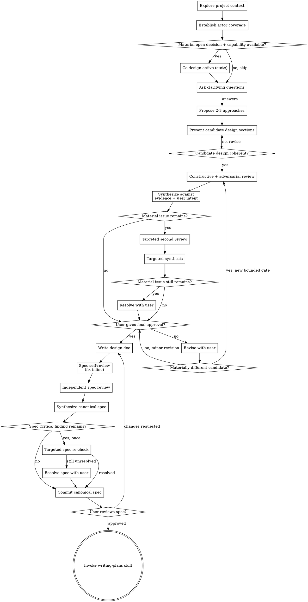

# Process Flow (full decision graph)

**"Co-design active" is a state, not a step.** It does not do work before discovery. When it holds: the *Ask clarifying questions* step runs blind SA + independent question generation, then merge/filter/present, BEFORE the user answers; then, after the user's answers, the *Propose 2-3 approaches* step runs blind SA + independent approach generation, then synthesis. Order is always discovery questions → user answers → approach generation, co-design on or off (see `independent-co-design.md`).

**The terminal state is invoking writing-plans.** Do NOT invoke frontend-design, mcp-builder, or any other implementation skill. The ONLY skill you invoke after brainstorming is writing-plans.
