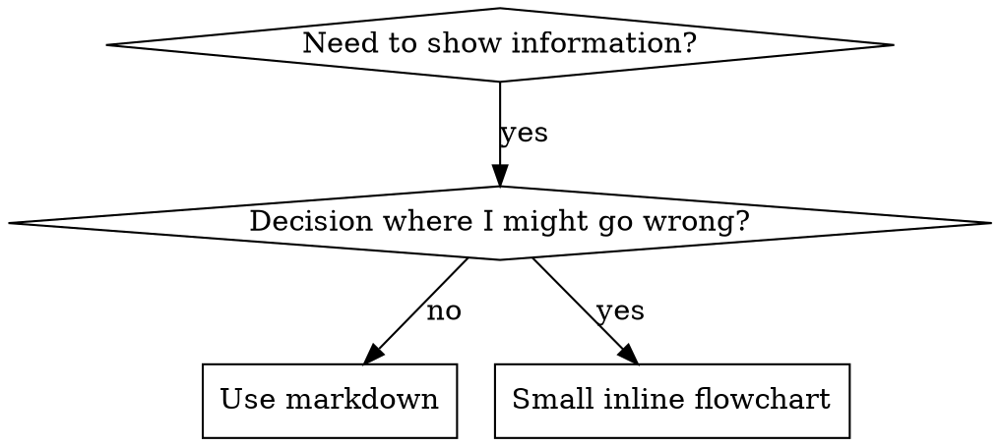

# Skill Style: Flowcharts, Examples, Anti-Patterns

## Flowchart usage



**Use flowcharts ONLY for:**
- Non-obvious decision points
- Process loops where you might stop too early
- "When to use A vs B" decisions

**Never use flowcharts for:**
- Reference material → tables, lists
- Code examples → markdown blocks
- Linear instructions → numbered lists
- Labels without semantic meaning (step1, helper2)

See [graphviz-conventions.dot](../graphviz-conventions.dot) for graphviz style rules.

**Visualizing for your human partner:** use [render-graphs.js](../render-graphs.js) to render a skill's flowcharts to SVG:
```bash
./render-graphs.js ../some-skill           # Each diagram separately
./render-graphs.js ../some-skill --combine # All diagrams in one SVG
```

## Code examples

**One excellent example beats many mediocre ones.**

Choose the most relevant language: testing techniques → TypeScript/JavaScript; system debugging → Shell/Python; data processing → Python.

**Good example:** complete and runnable, well-commented explaining WHY, from a real scenario, shows the pattern clearly, ready to adapt (not a generic template).

**Don't:** implement in 5+ languages, create fill-in-the-blank templates, write contrived examples. You're good at porting — one great example is enough.

## Anti-patterns

### ❌ Narrative example
"In session 2025-10-03, we found empty projectDir caused..."
**Why bad:** too specific, not reusable.

### ❌ Multi-language dilution
example-js.js, example-py.py, example-go.go
**Why bad:** mediocre quality, maintenance burden.

### ❌ Code in flowcharts
```dot
step1 [label="import fs"];
step2 [label="read file"];
```
**Why bad:** can't copy-paste, hard to read.

### ❌ Generic labels
helper1, helper2, step3, pattern4
**Why bad:** labels should have semantic meaning.
